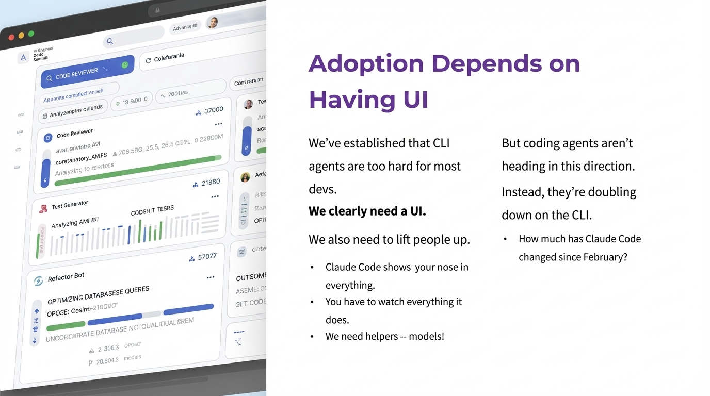

# nano-banana

CLI and Claude Code plugin for AI image generation, editing, and video generation with Google Gemini and Veo.

## Examples

<table>
<tr>
<td align="center"><b>Photorealistic</b></td>
<td align="center"><b>App Icon</b></td>
<td align="center"><b>Header Image</b></td>
</tr>
<tr>
<td></td>
<td></td>
<td></td>
</tr>
<tr>
<td><i>"A fluffy orange tabby cat curled up on a velvet armchair, soft afternoon sunlight..."</i></td>
<td><i>"Minimalist app icon for a meditation app. Simple lotus flower..."</i></td>
<td><i>"Wide 16:9 header image for a technology blog. Clean minimalist design..."</i></td>
</tr>
</table>

## Installation

```bash
# Run directly with npx (auto-downloads dependencies)
npx @the-focus-ai/nano-banana --help

# Or install globally
npm install -g @the-focus-ai/nano-banana
```

## Quick Start

```bash
# Set your API key
export GEMINI_API_KEY="your-key-here"

# Generate an image
nano-banana "a cat wearing a hat"

# Edit an existing image
nano-banana "make it cartoon" --file photo.jpg

# Save to specific path
nano-banana "a sunset" --output sunset.png
```

## Usage

```
nano-banana <prompt> [options]

Options:
  --file <image>       Input image to edit (optional, omit for text-to-image)
  --output <file>      Output file path (default: output/generated-<timestamp>.png)
  --model <name>       Gemini model to use (default: nano-banana-pro-preview)
  --flash              Use gemini-2.0-flash model (faster)
  --prompt-file <path> Read prompt from file instead of argument
  --list-models        List all available Gemini models
  --help, -h           Show this help message
```

## Prompting Tips

For best results, include these elements in your prompts:

1. **Subject**: Be specific ("fluffy orange tabby cat" not just "cat")
2. **Style**: Reference a style ("watercolor", "photorealistic", "minimalist")
3. **Lighting**: Describe the mood ("soft afternoon sunlight", "dramatic chiaroscuro")
4. **Composition**: Guide the layout ("close-up", "wide 16:9", "centered")
5. **Exclusions**: Say what you DON'T want ("NO dark backgrounds, NO neon")

**Weak prompt:**
```
a mountain
```

**Strong prompt:**
```
A dramatic mountain landscape with snow-capped peaks reflected in a still
alpine lake at sunset. Golden hour lighting, wide panoramic composition,
professional landscape photography style. NO people, NO text.
```

See [skills/nano-banana-imagegen/prompting-guide.md](skills/nano-banana-imagegen/prompting-guide.md) for comprehensive guidance.

## Image Editing

Edit existing images by providing an input file:

```bash
# Add elements
nano-banana "add a hot air balloon in the sky" --file landscape.jpg

# Style transfer
nano-banana "transform into a watercolor painting" --file photo.jpg

# Remove/modify
nano-banana "remove the background, replace with gradient" --file portrait.jpg
```

## Claude Code Plugin

This package includes a Claude Code plugin with the `nano-banana-imagegen` skill. When installed, Claude can generate and edit images for you automatically.

### Install the Plugin

```bash
# Add the marketplace (if not already added)
/plugin marketplace add The-Focus-AI/nano-banana-cli

# Install the plugin
/plugin install nano-banana-imagegen@The-Focus-AI
```

### Use with Claude

Just ask Claude to create images:

- "Generate a hero image for my blog post about AI"
- "Create a minimalist logo for a fitness app"
- "Edit this photo to look like a vintage film photograph"

Claude will use the skill to craft effective prompts and run the CLI.

## Getting Your API Key

1. Go to [Google AI Studio](https://aistudio.google.com/apikey)
2. Sign in with your Google account
3. Click "Create API Key"
4. Set it: `export GEMINI_API_KEY="your-key"`

Or use a `.env` file:

```bash
echo "GEMINI_API_KEY=your_api_key_here" > .env
```

## Batch Processing

Process multiple images with the included Makefile:

```bash
# Place images in input/ directory
make process PROMPT=slide-extractor

# Or with a custom prompt
make process PROMPT="extract the slide content cleanly"
```

### Example: Slide Extraction

Transform photos of presentation slides into clean images:

<table>
<tr>
<td width="50%"><b>Before</b></td>
<td width="50%"><b>After</b></td>
</tr>
<tr>
<td></td>
<td></td>
</tr>
</table>

## Project Structure

```
.claude-plugin/          # Claude Code plugin manifest
  plugin.json
skills/                  # Claude Code skills
  nano-banana-imagegen/
    SKILL.md             # Main skill instructions
    prompting-guide.md   # Comprehensive prompting guide
    examples/            # Categorized prompt examples
cli.ts                   # TypeScript CLI (runs via tsx)
```

## License

MIT
